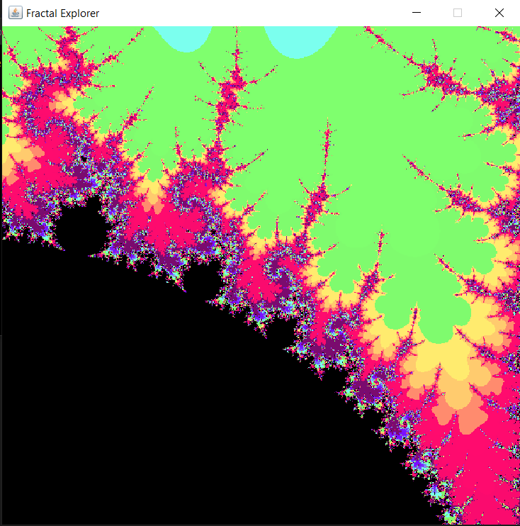

# Follow the steps below to get the project running locally.


##### -- Install latest JDK. (Add to path)
##### -- Clone the repo.
##### -- Navigate to root directory (cd fractalExplorerJava)
##### -- Run the file using following command
#
```
java fractalExplorer.java
```

# Some pics



